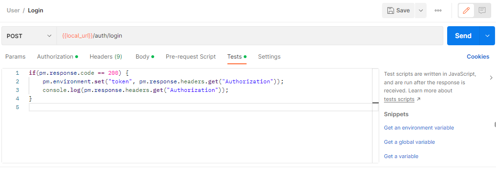

# Postman 이용 시 토큰 자동화
REST API를 개발하고 Postman으로 테스트를 할 때 인증이 필요한 요청이 있는 경우 토큰을 인증헤더에 넣어야 합니다.

매번 요청을 하고 Response 된 값을 복사해서 토큰을 넣는 것은 번거롭고 귀찮은 일입니다. 이를 해결 하기 위한 방안입니다.

<br>

## 방법
### 1. 환경 생성


'+'를 눌러 환경을 생성하고 Variable에 token을 입력하고 저장합니다.

<br>
<br>

### 2. 토큰 주입


토큰을 생성해주는 API로 가서 Tests로 들어갑니다.

```
if(pm.response.code == 200) {
    pm.environment.set("token", pm.response.headers.get("Authorization"));
    console.log(pm.response.headers.get("Authorization"));
}
```
제가 만든 토큰 생성 API는 response 헤더의 Authorization에 토큰을 넣어 전달하기 때문에 해당 코드를 사용하였습니다.

<br>

만일 response body 값에 토큰을 넣는다면 해당 코드를 사용하면 됩니다.

```
var data = JSON.parse(responseBody);
pm.environment.set("token", data.{토큰변수명})
```


