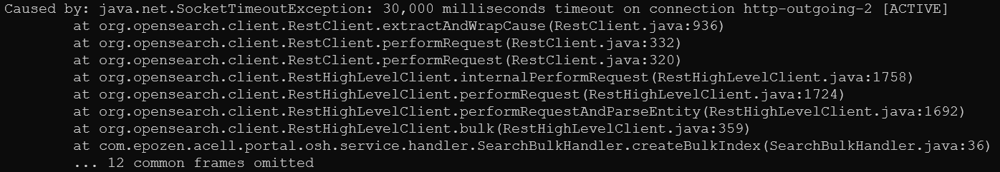
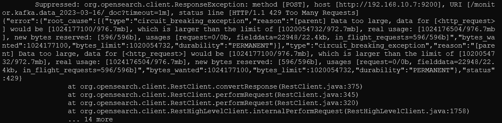
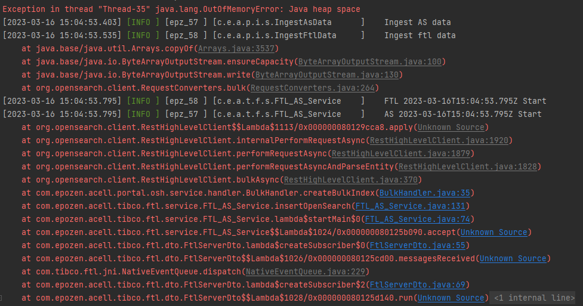

# 오픈서치 데이터 저장시 timeout 이슈
OpenSearch를 사용하면서 발생한 오류를 작성하였습니다.

<br>

## 1. 에러: Caused by: java.net.SocketTimeoutException: 30,000 milliseconds timeout on connection http-outgoing-2 [ACTIVE]


<br>
<br>


### 에러 상황
- OpenSearch Insert 후 timeout 오류가 발생함
- default timeout 설정 값으로 30초 (30,000ms)가 설정되어 있는 상태
- 실제 OpenSearch는 문제 없이 정상 작동중

<br>

### 원인 분석
- 클라이언트에서 connection 종료를 인지하지 못하고 계속들고있다가 lost connection으로 시도하는것으로 추측됨 

- (https://taes-k.github.io/2021/04/29/elasticsearch-timeout/ )

<br>

### 해결 방법

``` Java
@Slf4j
@Configuration
public class OpensearchInit {
    @Value("${opensearch.id}")
    private String userName;
    @Value("${opensearch.pw}")
    private String password;
    @Value("${opensearch.ip}")
    private String hostIp;
    @Value("${opensearch.port}")
    private int hostPort;
    @Value("${opensearch.protocol}")
    private String protocol;

    private final int SET_TIME_OUT = 1000 * 30;

    @Bean
    public RestHighLevelClient restHighLevelClient() {
        return new RestHighLevelClient(
                RestClient.builder(new HttpHost(this.hostIp, this.hostPort, this.protocol))
                            .setRequestConfigCallback(c -> {
                                c.setConnectTimeout(SET_TIME_OUT);
                                c.setSocketTimeout(SET_TIME_OUT);
                                return c;}
                            )
        );
    }
}
```
OpenSearch 객체를 생성할 때 ConnectTimeout, SocketTimeout을 설정한다.


<br>
<br>
<br>

## 2. 에러:  OpenSearchStatusException[OpenSearch exception [type=circuit_breaking_exception, reason=[parent] Data too large, data for [<http_request>]



### 에러 상황
- OpenSearch가 circuit_breaking_exception을 발생시켰다


<br>

### 원인 분석
- circuit_breaking_exception : OpenSearch가 제한된 메모리 용량 안에서 데이터 처리를 하기 위해 circuit breaker를 사용하는데, 이를 통해 지정된 한계를 초과하면 작업을 중지한 에러

<br>

### 해결 방법
- 힙 메모리 크기 수정
- 데이터 처리 방법 변경

<br>

#### 힙 크기 변경
OpenSearch의 config 파일 중 jvm.options 수정


```
- Xms1g -> Xms30g : 최소
- Xmx1g -> Xmx30g : 최대
```


# 
힙 크기를 30GB로 변경하였다. 왜 30GB로 변경했을까

엘라스틱서치(오픈서치)는 메모리를 많이 사용하는 애플리케이션이다. 일반적으로 힙 메모리가 많을수록 그에 비례하여 성능도 올라간다.

자바 애플리케이션에서 너무 작은 힙 크기는 OOM 오류 (Out-Of-Memory Exception)를 발생시킬 수 있으며, 반대로 너무 큰 힙 크기는 FullGC가 발생할 때 시스템 전체가 마비되는 STW(Stop The World)를 발생시킬 수 있습니다.

일반적인 상황에서는 엘라스틱서치(오픈서치)에 설정된 힙의 크기가 클수록 좋습니다. 하지만 그렇다고해서 무작정 큰 메모리를 할당하는 것은 성능에 심각한 문제를 야기시킬 수 있습니다. 엘라스틱서치에서는 할당할 힙 크기의 최대값으로 32GB 이하를 설정하도록 권장합니다.


## 3. 에러: Exception in thread "Thread-35" java.lang.OutOfMemoryError: Java heap space



### 에러 상황
- JVM에서 힙 메모리 초과 오류가 났다
- 힙 메모리는 JVM에서 사용하는 메모리 영억 중 하나, 동적으로 생성되는 객체가 저장되는 곳이다.
    해당 에러는 프로그램이 필요한 만큼의 메모리를 할당 받지 못해 발생한다.

<br>

### 원인 분석
- 데이터 처리량이 많아서 메모리를 소모하는 경우
- 무한루프나  재귀 호출로 인해 메모리를 무한정 소모
- 대용량 데이터를 처리하는 경우

<br>

### 해결 방법
- 대용량 데이터 처리를 하는 경우에 발생하는 오류인 것으로 판단하여 1회 전송 데이터를 수집하여 분석

<br>