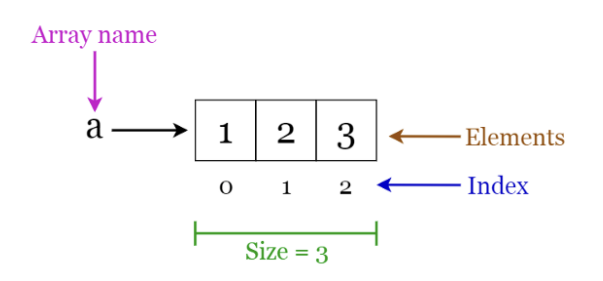
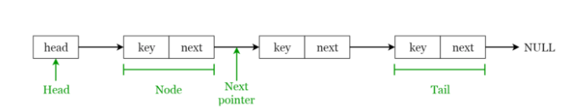
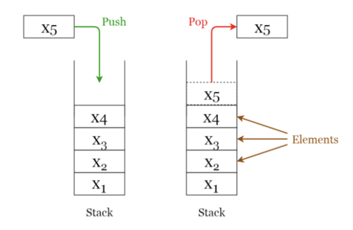
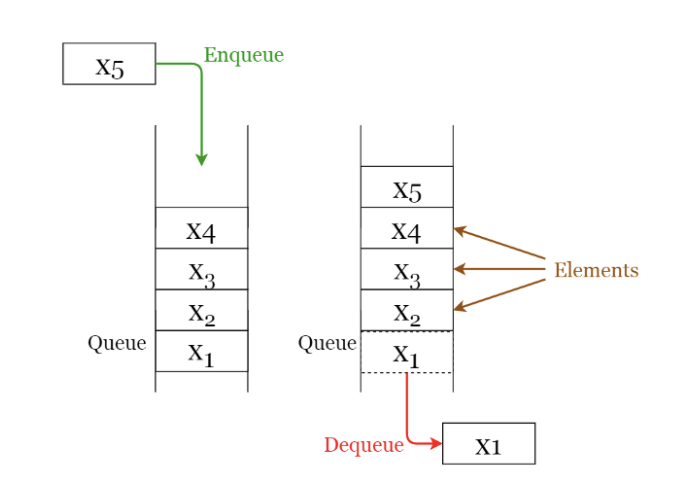
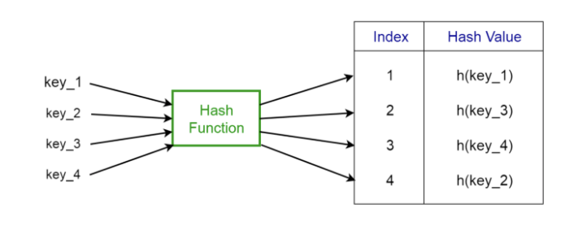
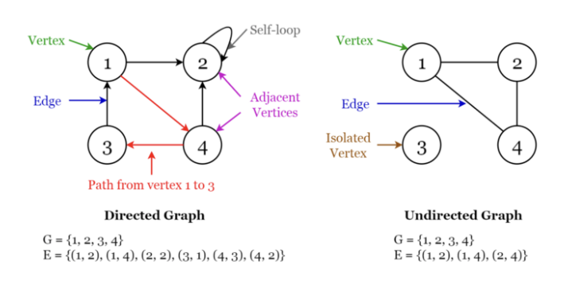
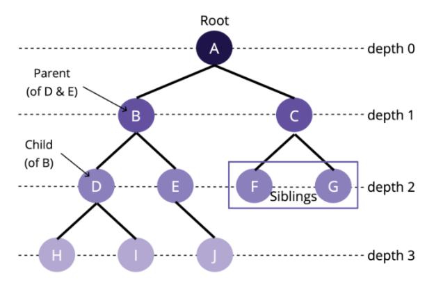

# 자료구조
자료구조란 자료의 집합을 의미하며, 각 원소들이 논리적으로 정의된 규칙에 의해 나열되며 자료에 대한 처리를 효율적으로 수행할 수 있도록 자료를 구분하여 표현하는 것입니다.

자료의 효율적인 관리는 프로그램의 수행속도와 밀접한 관련이 있습니다.

 

## 자료구조의 선택 기준
- 처리 시간
- 크기
- 활용 빈도
- 갱신 정도
- 프로그램의 용이성

 

## 자료구조의 특징
- 효율성
    - 효율적인 데이터의 관리 및 사용
    - 적절한 자료구조를 이용하여 데이터 처리 효율 증가

- 추상화
    - 복잡한 자료, 모듈, 시스템 등으로부터 핵심적인 개념을 가져온다. 
    - ex) Stack의 push() 함수를 이용하여 데이터 삽입을 의미, 함수를 어떻게 구현했는가는 중요하지 않다

- 재사용성
    - 다양한 프로그램에서 동작할 수 있도록 범용성 있게 설계

## 자료구조의 분류
- 선형 구조 
    - 선형 리스트
        - 배열
        - 레코드
    - 연결 리스트
    - 스택
    - 큐
    - 해시 테이블
- 비선형 구조 
    - 트리
        - 일반 트리
        - 이진 트리
    - 그래프
        - 방향 그래프
        - 무방향 그래프
- 파일 구조
    - 직접 파일
    - 순차 파일
    - 색인 순차 파일        

 

선형 구조 : 자료를 구성하는 원소들을 하나씩 순차적으로 나열시킨 형태 1:1 관계
비선형 구조 : 하나의 자료 뒤에 여러 개의 자료가 존재할 수 있는 형태 1:n or n:m 관계

### 1. 배열

장점 
- 인덱싱이 되어 있어 인덱스 번호로 데이터에 접근할 수 있다.
- 원하는 데이터를 효율적으로 탐색할 수 있다.
- 삽입, 퀵, 버블, 병합 정렬에 용의하다.

단점
- 동일한 타입의 데이터들을 저장하며, 고정된 크기를 가지고 있다.
- 데이터 추가/삭제, 구조 재구성 시 정렬하는 방식이 비효율적이다.

시간 복잡도 O(n) (조회, 추가, 삭제)

 

### 2. 연결 리스트

장점
- 각 데이터 시퀀스가 순서를 가지고 연결된 순차적 구조
- 동적인 데이터 추가/삭제에 유리하고 동적인 메모리 크기를 가지고 있다.
- 데이터 추가 및 삭제가 효율적이다
- 배열처럼 메모리에 연속적으로 위치하지 않고 구조의 재구성이 필요없다.
- 메모리를 효율적으로 쓸 수 있기 때문에 대용량 데이터 처리에 적합하다.

단점
- 원하는 데이터를 조회할 때 처음부터 끝까지 순회하기 때문에 비효율적이다.
- 배열보다 메모리를 더 사용한다.
- 노드를 반대 방향으로 검색할 때 비효율적이다.

시간 복잡도
- 조회 O(n)
- 추가 O(1)
- 삭제 O(1)

 

### 3. 스택

장점
- 순서가 보존되는 선형 데이터 구조
- LIFO(Last In First Out) 가장 마지막에 들어 온 요소가 처음으로 나간다.
- 동적인 메모리 크기, 데이터를 받는 순서대로 정렬, 빠른 런타임
- 가장 마지막으로 입력된 것을 순차적 처리, 뒤로가기, 실행 취소, 재귀에 용이

단점
- 가장 최신 요소만 가져온다.
- 한번에 하나의 데이터만 처리 가능하다.

시간 복잡도
- 조회 O(n)
- 추가 O(1)
- 삭제 O(1)

 

### 4. 큐

장점
- FIFO(First In First Out) 가장 먼저 들어 온 요소가 처음으로 나간다.
- 동적인 메모리 크기, 데이터를 받는 순서대로 정렬, 빠른 런타임
- 멀티스레딩에서 스레드 관리, 대기열 시스템에 용이
- 프린트 대기열처럼 가장 먼저 입력 받는 데이터 처리, 캐시 구현

단점
- 가장 오래된 요소만 가져온다.
- 한번에 하나의 데이터만처리 가능하다.

시간 복잡도
- 조회 O(n)
- 추가 O(1)
- 삭제 O(1)

 

### 5. 해시 테이블

장점
- 해시함수를 이용하여 변환한 값을 색인으로 삼아 키와 데이터로 저장하는 자료 구조
- 데이터의 크기와 관계 없다
- 새로운 요소들의 추가/삭제가 용이하고 효율적이다
- 원하는 값의 검색이 빠르고 효유렂ㄱ이다
- 동적인 메모리 크기 (하지만 직접 크기를 늘리거나 줄여야 함)

단점
- 충돌이 일어날 수 있다.

시간 복잡도
- 조회 O(1)
- 추가 O(1)
- 삭제 O(1)

### 6. 그래프

노드 사이에 엣지가 있는 collection, 엣지는 방향이 정해질 수 있다.

장점
- 새로운 요소들의 추가/삭제가 용이하고 효율적이다
- 구조의 응용이 가능하다

단점
- 충돌이 일어날 수 있다.

시간 복잡도 : 그래프가 리스트 형태로 설계 되어 있는 경우, N=node, E=edge
- 조회 O(1)
- 추가 O(|N| + |E|)
- 삭제 O(|E|)

 

### 7. 트리

- 그래프의 일종으로 정점과 간선을 이용하여 데이터의 배치 형태를 추상화한 자료구조
- 서로 다른 두 노드를 연결하는 길이 하나뿐인 그래프를 트리라고 한다.
- 그래프가 계층적 구조

장점
- 데이터의 저장보단 저장된 데이터를 더 효과적으로 탐색
- 부모와 자식의 계층적인 관계

